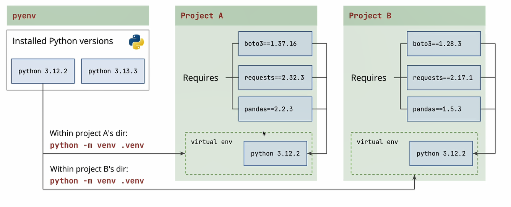

## Python virtual environment
A Python virtual environment is an isolated Python runtime + dependency graph created for a single project so that package versions, Python interpreter, and tooling do not leak across projects or into the system Python.

Createing vents:
 python -m vent .vent