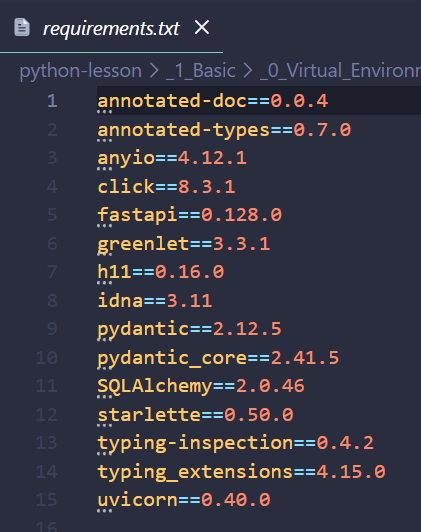

## Python virtual environment
A Python virtual environment is an isolated Python runtime + dependency graph created for a single project so that package versions, Python interpreter, and tooling do not leak across projects or into the system Python.


<!-- Createing vents:
 python -m vent .vent -->

### Basic Commands

- **Check version**: `python3 --version`
- **Check installed pythons**: `ls /usr/bin/python*`

### Install Newer Versions
```
# Add a repository with newer Python versions
    sudo add-apt-repository ppa:deadsnakes/ppa
    sudo apt update

# For Python 3.11
    sudo apt install python3.11 python3.11-venv python3.11-dev

# For Python 3.12
    sudo apt install python3.12 python3.12-venv python3.12-dev

# For Python 3.13
    sudo apt install python3.13 python3.13-venv python3.13-dev

# For Python 3.14
    sudo apt install python3.14 python3.14-venv python3.14-dev

python3.11 --version
python3.12 --version
python3.13 --version
python3.14 --version
```


<h3 style="color: #22c1d2;">Create ProjA with python version 3.10</h3>

---


**Create tow Dirs**: `projA` `projB` `projB`

**Navigate to projA**: `./projA`

**Create virtual env**: `python3 -m venv .venv`
<p style="color: #6e7677;">This will create a virtual environment in the .venv directory</p>

**Activate it**: `source .venv/bin/activate`

<p style="color: #6e7677;">You should see (.venv) in your prompt now.</p>

**Check Python version**: `python --version`

<p style="color: #6e7677;">Should match your system Python (3.10.12).</p>

<br/>
<br/>

<h3 style="color: #22c1d2;">Create a virtual environment with a specific Python version:</h3>

**Navigate to projB**

`python3.14 -m venv myenv `

`source myenv/bin/activate `

**Verify**:
```
which python
python --version
pip --version
```

**Installing dependencies**
    `pip install fastapi uvicorn sqlalchemy`

**They install into**:
    `venv/lib/python3.xx/site-packages`

**To deactive**:
 `deactivate`

---

<h3 style="color: #22c1d2;">Freezing dependencies (non-negotiable):</h3>
lets assume you created a virtual env for to projB
<br>

- *Navigate to projB*

**Run**:
```
python3.14 -m venv myenv
source myenv/bin/activate
which python
python --version
pip --version
pip install fastapi uvicorn sqlalchemy   #instaling dependencies
pip freeze > requirements.txt          #this is you freezing the dependencies

```

- The dependencies will appearn in **`venv/lib/python3.14/site-packagesl `**
- Applying `pip freeze > requirements.txt` will create a `requirements.txt` file in the root directory of projB with the dependencies shown in the screenshot below:



- This is saying
    `“Install exactly these versions. No upgrades. No interpretation.”`
- If this project is to be reproduced after deletion or pull from github, All you need is to run `pip install -r requirements.txt` to install the dependencies, instead of `pip install fastapi uvicorn sqlalchemy` 
- Thas is:
```
python3.14 -m venv myenv
source myenv/bin/activate
pip install -r requirements.txt
```